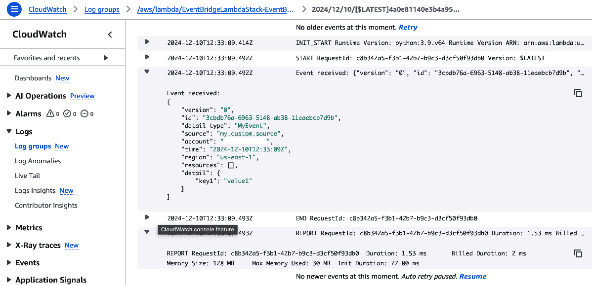

```
# aws events put-events --entries '[                               
      {
        "Source": "my.custom.source",
        "DetailType": "MyEvent",
        "Detail": "{\"key1\": \"value1\"}"
      }
    ]'
{
    "FailedEntryCount": 0,
    "Entries": [
        {
            "EventId": "3cbdb76a-6963-5148-ab38-11eaebcb7d9b"
        }
    ]
}
```



